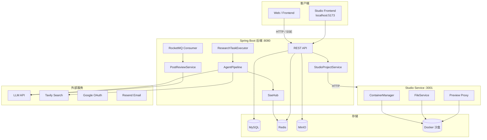
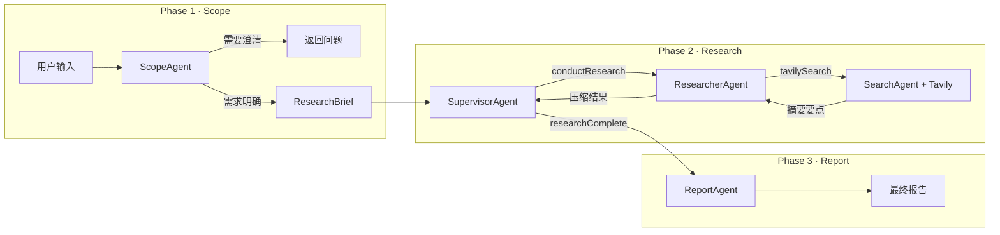
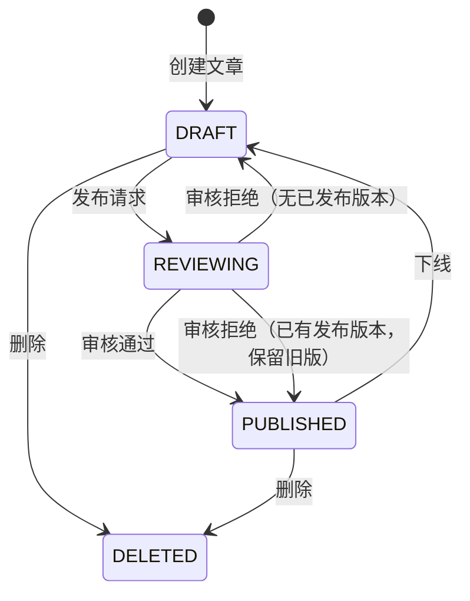
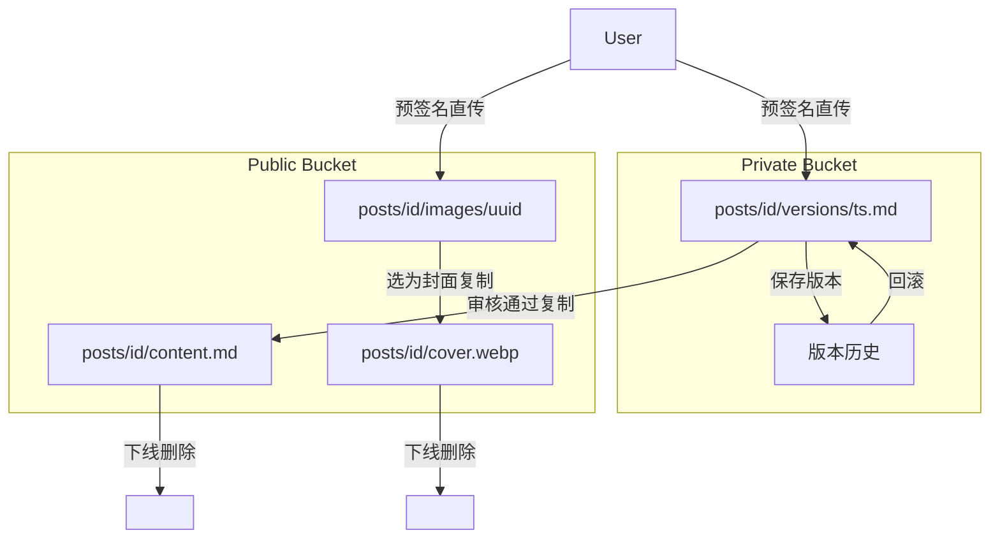

# KnowNote

KnowNote 是一个基于 Spring Boot 3 的知识写作与 AI 研究平台，提供 AI 多智能体深度研究、类 Bolt.new 的浏览器端 AI 代码生成（Studio）、Markdown 文章版本管理与内容审核等功能。

## 核心功能

### 深度研究
多智能体协作工作流（ScopeAgent → SupervisorAgent → ResearcherAgent → ReportAgent），通过 SSE 实时推送每一个研究阶段的进度，最终生成结构化研究报告。

### Studio — AI 代码生成
类 Bolt.new 的浏览器端 IDE。用户通过对话描述需求，AI 分两阶段（架构设计 + 代码生成）输出完整项目文件，代码实时写入 Docker 沙盒容器并在浏览器内预览运行效果。

### 文章管理
Markdown 富文本编辑，支持草稿 / 发布 / 版本历史 / 一键回滚。封面和正文通过 MinIO 预签名 URL 直传，不经过后端。

### 内容审核
发布触发 RocketMQ 异步消息，LLM 对内容进行合规性判断，自动流转 DRAFT → REVIEWING → PUBLISHED / REJECTED 状态机。

### 用户认证
邮箱验证码 / 密码双通道登录，支持 Google OAuth。JWT 双令牌（access + refresh）机制，refresh token 存入 Redis 支持多端登出。

---

## 技术栈

| 层次 | 技术选型 |
|------|---------|
| 语言 / 框架 | Java 21 + Spring Boot 3.5 |
| ORM | MyBatis-Plus |
| 数据库 | MySQL 8.0 |
| 缓存 | Redis（Redisson） |
| 消息队列 | RocketMQ 5 |
| 对象存储 | MinIO（S3 兼容） |
| AI 框架 | LangChain4j 1.8 |
| Studio 沙盒 | Node.js 20 + Fastify + Dockerode |
| Studio 前端 | React 18 + Vite + Monaco Editor |
| API 文档 | SpringDoc OpenAPI + Scalar UI |
| 邮件 | Resend |
| 认证 | JWT（jjwt 0.12）+ jBCrypt |

---

## 系统架构



### 深度研究智能体工作流



### 内容审核状态机



### 双 Bucket 对象存储



---

## 项目结构

```
KnowNote/
├── src/main/java/dev/haotangyuan/knownote/   # Spring Boot 后端
│   ├── common/          # 通用组件（异步队列、SseHub、工具类、@QueuedAsync AOP）
│   ├── config/          # 配置（JWT、MinIO、RocketMQ、LLM、OpenAPI、JwtFilter）
│   ├── user/            # 用户模块（注册/登录、Token、Google OAuth）
│   ├── research/        # 深度研究模块
│   │   ├── agent/       # ScopeAgent / SupervisorAgent / ResearcherAgent / ReportAgent
│   │   ├── tool/        # LangChain4j Tool 注册（@ResearcherTool / @SupervisorTool）
│   │   ├── workflow/    # AgentPipeline 流水线编排
│   │   └── client/      # Tavily REST 客户端
│   ├── post/            # 文章模块（CRUD、版本历史、审核 MQ 消费）
│   ├── studio/          # Studio AI 代码生成
│   │   ├── api/         # StudioProjectController + DTO
│   │   ├── agent/       # CodeGenAgent（LangChain4j 流式）
│   │   ├── pipeline/    # CodeGenPipeline（Architect → Coder 两阶段）
│   │   ├── config/      # StudioModelConfig（LLM Bean）
│   │   ├── domain/      # StudioProjectDO + Mapper
│   │   ├── service/     # StudioProjectService
│   │   └── sse/         # StudioSseHub
│   ├── storage/         # MinIO 预签名上传
│   ├── like/            # 点赞（MQ 异步聚合）
│   └── count/           # 计数消费
├── studio-service/      # Node.js 沙盒管理服务（Fastify :3001）
│   └── src/
│       ├── ContainerManager.ts   # Docker 生命周期
│       ├── FileService.ts        # 工作区文件读写
│       └── routes/               # containers / files / preview / ws
├── studio-frontend/     # React 前端（Vite :5173）
│   └── src/
│       ├── components/  # ChatPanel / EditorPanel / PreviewPanel
│       ├── hooks/       # useSseStream / useContainerWs
│       └── store/       # Zustand 全局状态
└── sandbox-image/       # 沙盒 Docker 镜像（Node.js 20 + Vite）
    ├── Dockerfile
    └── workspace-template/   # React + Vite 初始模板
```

---

## 文档

| 文档 | 说明 |
|------|------|
| [DEVELOPMENT.md](./DEVELOPMENT.md) | 本地开发环境搭建、服务启动、环境变量配置 |
| [studio-service/README.md](./studio-service/README.md) | studio-service API 参考文档 |
| `http://localhost:8080/docs` | 在线 API 文档（Scalar UI，服务启动后访问） |
