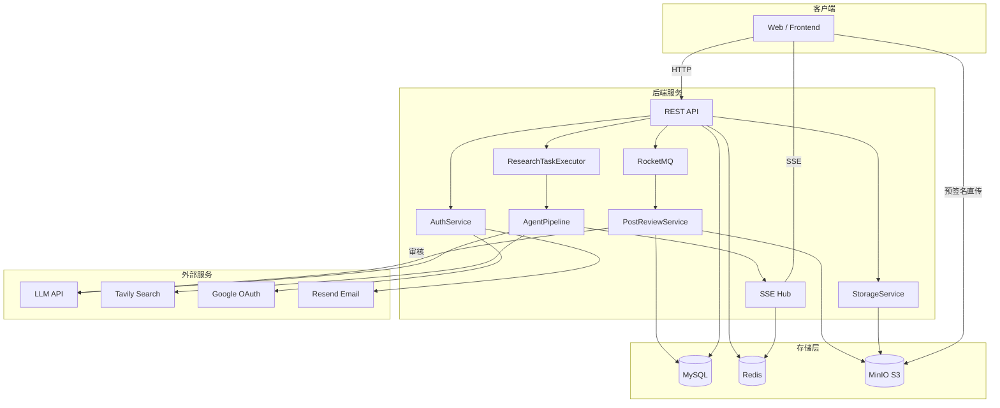
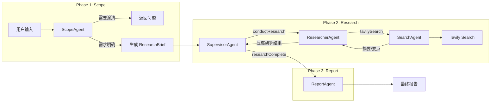
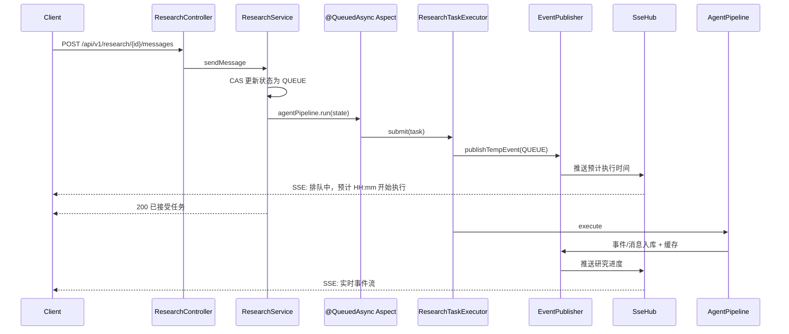
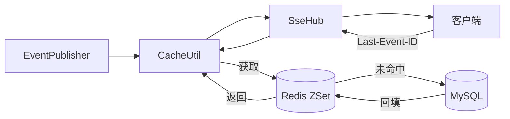
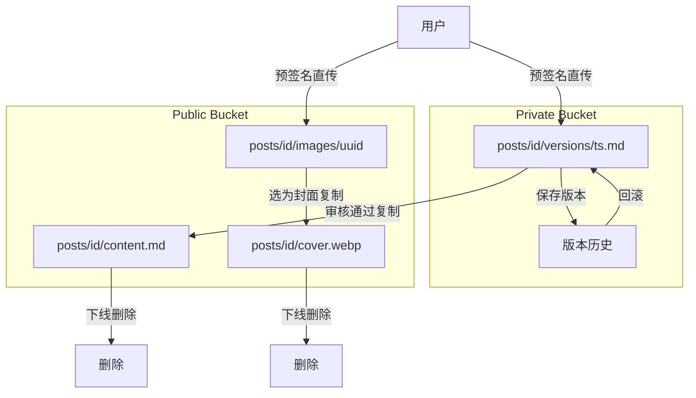
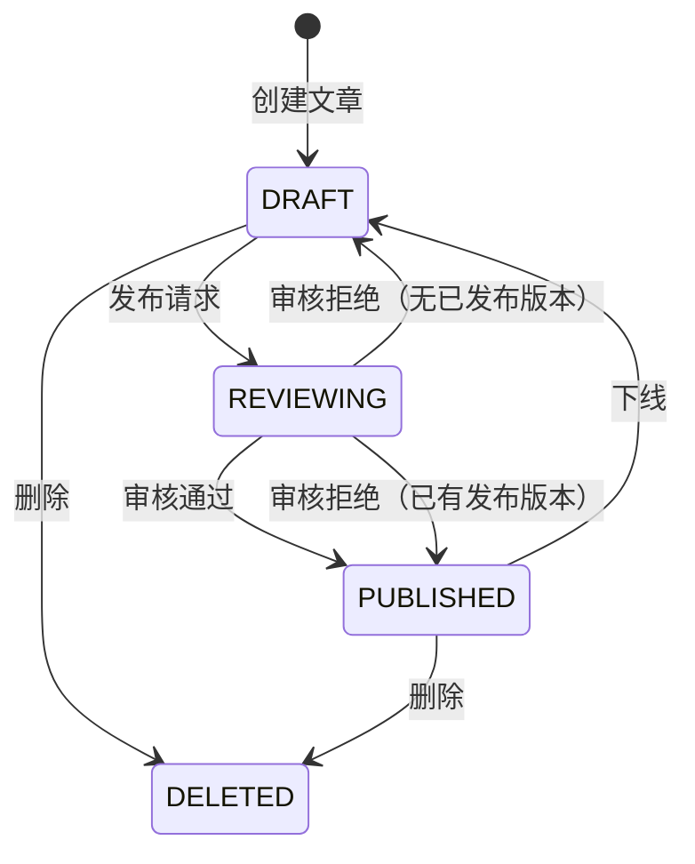

# KnowNote — 知识写作平台

基于 Spring Boot 3 的知识写作与深度研究平台，提供 AI 多智能体协作研究、文章版本管理、内容审核等功能。

## 功能特性

- **用户认证** — 邮箱验证码/密码登录 + Google OAuth，JWT 双令牌（access + refresh）
- **深度研究** — 多智能体协作（ScopeAgent → SupervisorAgent → ResearcherAgent → ReportAgent），SSE 实时推送进度
- **文章管理** — Markdown 编辑、版本历史、草稿/发布状态、版本回滚
- **内容审核** — RocketMQ 异步审核，LLM 判定合规性后自动流转状态
- **点赞系统** — 异步消息队列聚合计数

## 技术栈

| 类别 | 技术 | 版本 |
|------|------|------|
| 语言 / 框架 | Java + Spring Boot | Java 21 + Spring Boot 3.5.9 |
| 构建工具 | Maven | 3.9.12（项目自带 mvnw wrapper） |
| ORM | MyBatis-Plus | 3.5.11 |
| 数据库 | MySQL | 8.0+（驱动 mysql-connector-j 9.5.0） |
| 缓存 | Redis + Redisson | Redis 6.0+ / Redisson 3.52.0 |
| 消息队列 | RocketMQ | 5.3.1（rocketmq-spring-boot-starter 2.3.1） |
| 对象存储 | MinIO（S3 兼容） | latest（AWS SDK S3 2.25.45） |
| LLM 框架 | LangChain4j | 1.8.0 |
| API 文档 | SpringDoc OpenAPI + Scalar UI | 2.8.14 |
| 邮件 | Resend | — |
| 认证 | JWT（jjwt）+ jBCrypt | jjwt 0.12.6 / jBCrypt 0.4 |
| 工具库 | Hutool / Lombok | Hutool 5.8.34 / Lombok 1.18.34 |
| Google OAuth | Google API Client | 2.7.2 |

## 系统架构



### 智能体工作流



### 异步任务队列



### SSE 断线重连



### 双 Bucket 存储



### 内容审核状态机



## 项目结构

```
src/main/java/dev/haotangyuan/knownote/
├── common/                     # 通用组件
│   ├── async/                  # @QueuedAsync 异步任务队列
│   ├── sse/                    # SSE 实时推送
│   └── util/                   # 缓存、事件发布、序列号等工具
├── config/                     # 配置类（JWT、OSS、RocketMQ、LLM、OpenAPI）
├── user/                       # 用户模块
│   ├── api/                    # Controller + DTO
│   ├── domain/                 # Entity + Mapper
│   └── service/                # 认证、Token、Google OAuth、验证码
├── research/                   # 深度研究模块
│   ├── agent/                  # Scope / Supervisor / Researcher / Search / Report
│   ├── tool/                   # 工具注册中心（@ResearcherTool / @SupervisorTool）
│   ├── workflow/               # AgentPipeline 流水线
│   ├── state/                  # DeepResearchState
│   ├── prompt/                 # Prompt 模板
│   ├── schema/                 # LLM 结构化输出 Schema
│   └── client/                 # Tavily 搜索客户端
├── post/                       # 文章模块
│   ├── api/                    # Controller + DTO
│   ├── domain/                 # Entity + Mapper + Enum
│   ├── service/                # 文章 CRUD、版本管理
│   └── mq/                     # 审核消息（Producer / Consumer / DLQ / Reviewer）
├── storage/                    # 存储模块（MinIO S3 预签名上传）
├── like/                       # 点赞模块（MQ 异步聚合）
└── count/                      # 计数模块（MQ 消费计数变更）
```

## 快速开始

### 1. 环境要求

| 依赖 | 版本 | 说明 |
|------|------|------|
| JDK | 21+ | [Adoptium 下载](https://adoptium.net/) 或 `brew install openjdk@21` |
| Maven | 3.9+ | 项目自带 mvnw wrapper，无需全局安装 |
| MySQL | 8.0+ | `brew install mysql` 或 [官方下载](https://dev.mysql.com/downloads/) |
| Redis | 6.0+ | `brew install redis && brew services start redis` |
| Docker | 20.10+ | RocketMQ + MinIO 需要，[Docker Desktop](https://www.docker.com/products/docker-desktop/) |

### 2. 克隆项目

```bash
git clone https://github.com/haotangyuan/KnowNote.git
cd KnowNote
```

### 3. 启动 Docker 中间件

项目通过 `docker-compose.yml` 管理 RocketMQ 和 MinIO，一条命令启动：

```bash
docker-compose up -d
```

| 服务 | 端口 | 用途 |
|------|------|------|
| `namesrv` | 9876 | RocketMQ 注册中心 |
| `broker` | 10911 | RocketMQ 消息代理 |
| `minio` | 9000 / 9001 | MinIO 对象存储（9000=API，9001=控制台） |

**创建 MinIO 存储桶（首次执行一次）：**

```bash
docker exec minio mc alias set local http://localhost:9000 minioadmin minioadmin
docker exec minio mc mb local/knownote-public local/knownote-private
```

MinIO 控制台：http://localhost:9001，用户名 `minioadmin`，密码 `minioadmin`。

### 4. 创建数据库

```sql
CREATE DATABASE IF NOT EXISTS db_knownote DEFAULT CHARACTER SET utf8mb4 COLLATE utf8mb4_unicode_ci;
```

应用首次启动时会通过 `schema.sql` 自动建表。

### 5. 配置环境变量

```bash
cp .env.example .env
```

编辑 `.env`，填入实际配置。以下是关键变量：

**必配项：**

| 变量 | 说明 | 示例 |
|------|------|------|
| `DB_USERNAME` | MySQL 用户名 | `root` |
| `DB_PASSWORD` | MySQL 密码 | `your_password` |
| `RESEARCH_MODEL` | 研究用 LLM 模型 | `deepseek-chat` |
| `RESEARCH_MODEL_BASE_URL` | LLM API 地址 | `https://api.deepseek.com` |
| `RESEARCH_MODEL_API_KEY` | LLM API Key | `sk-xxxx` |
| `TAVILY_API_KEY` | Tavily 搜索 Key | `tvly-xxxx` |

**可选配置：**

| 变量 | 说明 | 不配的影响 |
|------|------|-----------|
| `RESEND_API_KEY` | Resend 邮件 Key | 验证码打印在应用日志中 |
| `RESEND_FROM` | 已认证的发送邮箱 | 同上 |
| `GOOGLE_CLIENT_ID` | Google OAuth Client ID | Google 登录不可用 |
| `GOOGLE_CLIENT_SECRET` | Google OAuth Secret | 同上 |
| `GOOGLE_REDIRECT_URI` | Google OAuth 回调地址 | 同上 |
| `REVIEW_AI_*` | 审核 AI 配置 | 文章审核功能不可用 |

> 其余变量（MinIO、RocketMQ、Redis 等）已预设本地默认值，直接使用 Docker 服务即可，无需修改。

### 6. 启动应用

```bash
# 加载环境变量并启动
set -a && source .env && set +a && mvn spring-boot:run

# 或使用 mvnw wrapper
set -a && source .env && set +a && ./mvnw spring-boot:run
```

启动后访问：
- **应用**：`http://localhost:8080`
- **API 文档**：`http://localhost:8080/docs`（Scalar UI，无需登录）
- **健康检查**：`http://localhost:8080/actuator/health`

### 7. 功能启用状态

| 功能 | 依赖 | 默认状态 |
|------|------|---------|
| 用户注册/登录（密码） | MySQL + Redis | 可用 |
| 用户注册/登录（验证码） | 上述 + Resend | 需配置 Resend（未配则验证码打印日志） |
| Google OAuth 登录 | Google Client ID/Secret | 需自行配置 |
| 深度研究 | LLM API + Tavily | 配置 API Key 后可用 |
| 文章 CRUD | MinIO | 可用（Docker 已启动） |
| 文章发布/审核 | MinIO + RocketMQ | 可用 |
| 点赞 | RocketMQ + Redis | 可用 |

### 8. 快速测试

```bash
# 1. 发送验证码（未配 Resend 则验证码打印在日志中）
curl -X POST http://localhost:8080/api/v1/auth/code \
  -H "Content-Type: application/json" \
  -d '{"email":"test@example.com"}'

# 2. 用验证码注册
curl -X POST http://localhost:8080/api/v1/auth/register \
  -H "Content-Type: application/json" \
  -d '{"email":"test@example.com","username":"test","nickname":"测试用户","password":"123456","code":"<验证码>"}'

# 3. 密码登录
curl -X POST http://localhost:8080/api/v1/auth/login/password \
  -H "Content-Type: application/json" \
  -d '{"account":"test@example.com","password":"123456"}'

# 4. 创建研究任务（替换 YOUR_TOKEN）
curl -X POST http://localhost:8080/api/v1/research/create \
  -H "Authorization: Bearer YOUR_TOKEN" \
  -d '{"budget":"HIGH"}'
```

## API 概览

完整接口文档见 `http://localhost:8080/docs`（Scalar UI），支持在线测试和 Bearer Token 认证。

### 认证 `/api/v1/auth`

| 方法 | 路径 | 说明 |
|------|------|------|
| POST | `/code` | 发送验证码 |
| POST | `/register` | 邮箱注册 |
| POST | `/login/password` | 密码登录 |
| POST | `/login/code` | 验证码登录 |
| POST | `/login/google` | Google One Tap 登录 |
| POST | `/google/callback` | Google OAuth 回调 |
| POST | `/refresh` | 刷新 Token |
| POST | `/logout` | 登出 |

### 用户 `/api/v1/user`

| 方法 | 路径 | 说明 |
|------|------|------|
| GET | `/me` | 获取当前用户信息 |
| PUT | `/profile` | 更新个人资料 |
| PUT | `/password` | 修改密码 |

### 深度研究 `/api/v1/research`

| 方法 | 路径 | 说明 |
|------|------|------|
| POST | `/create` | 创建研究会话 |
| POST | `/{id}/messages` | 发送消息（SSE 流式返回） |
| GET | `/{id}/events` | 获取研究事件流 |
| GET | `/list` | 获取研究列表 |

### 文章 `/api/v1/post`

| 方法 | 路径 | 说明 |
|------|------|------|
| POST | `/create` | 创建文章 |
| POST | `/{id}/content` | 保存内容 |
| POST | `/{id}/metadata` | 保存元数据 |
| POST | `/{id}/publish` | 发布（触发异步审核） |
| POST | `/{id}/unpublish` | 下架 |
| POST | `/{id}/delete` | 删除 |
| POST | `/{id}/rollback` | 回滚版本 |
| GET | `/{id}` | 获取文章详情 |
| GET | `/{id}/versions` | 获取版本历史 |

### 点赞 `/api/v1/like`

| 方法 | 路径 | 说明 |
|------|------|------|
| POST | `/post` | 点赞/取消点赞 |
| GET | `/status` | 批量查询点赞状态 |

### 存储 `/api/v1/oss`

| 方法 | 路径 | 说明 |
|------|------|------|
| POST | `/url` | 获取预签名上传 URL |
