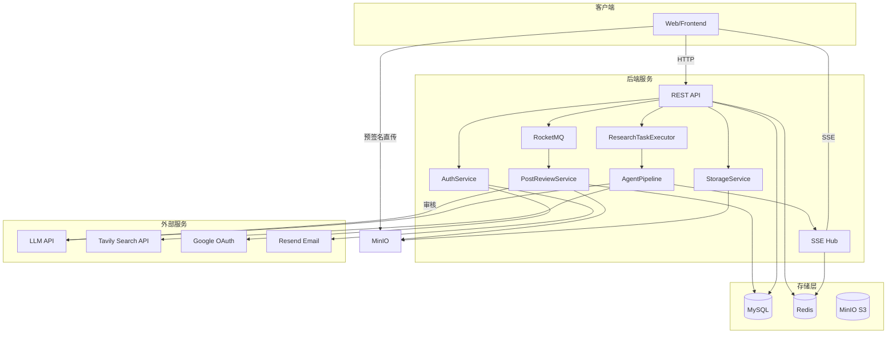
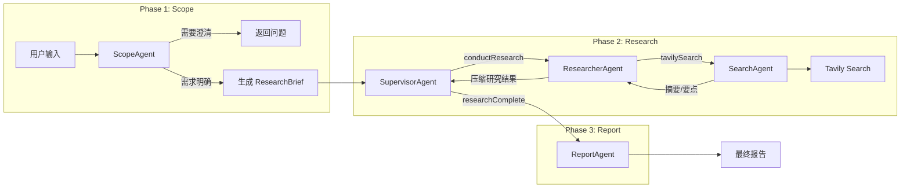
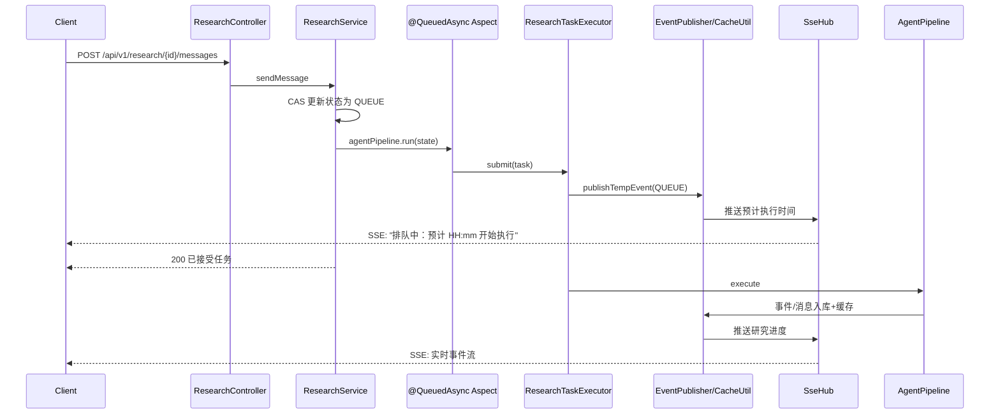
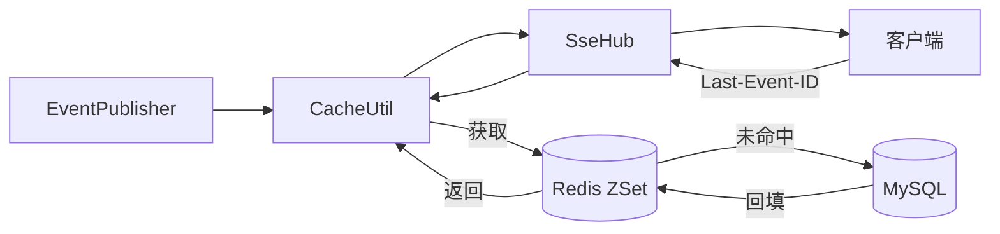
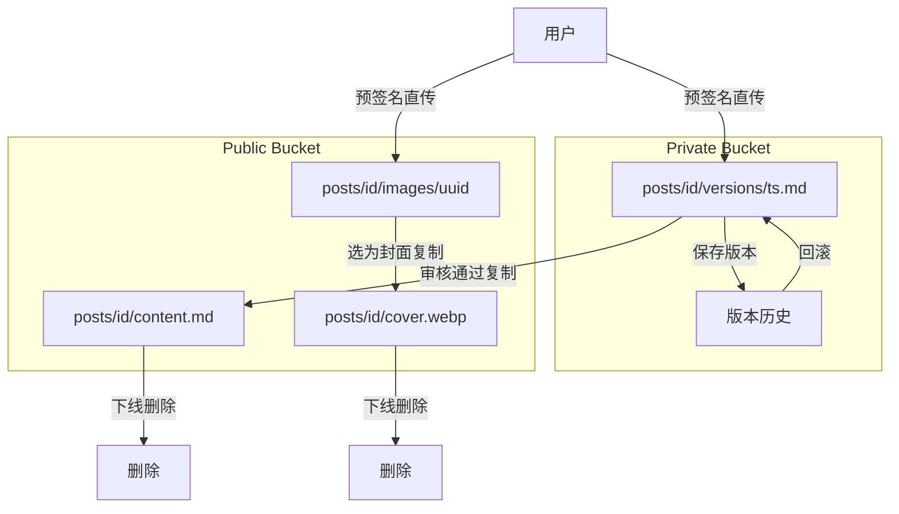
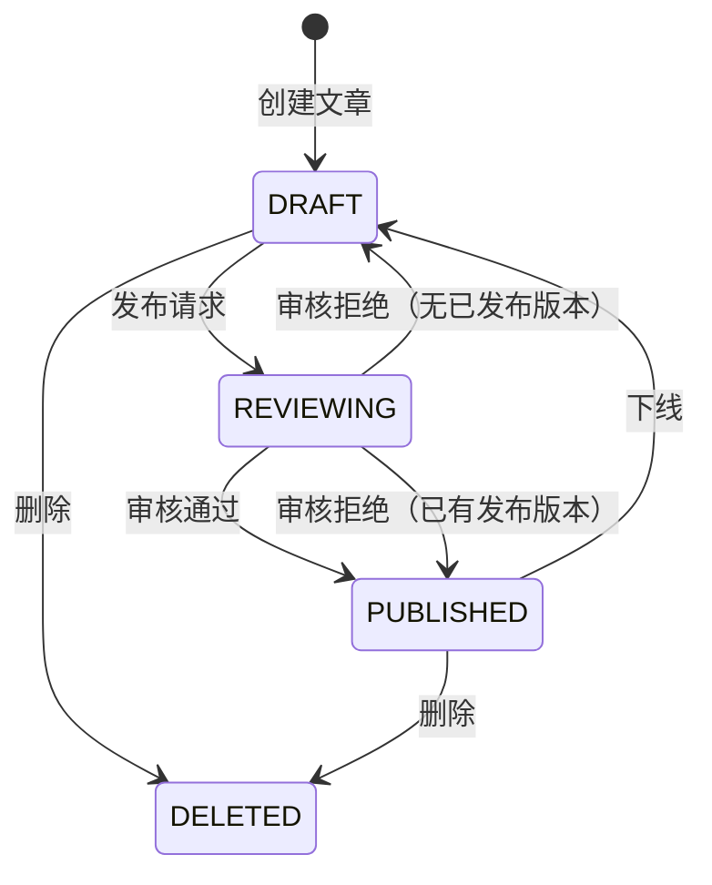

# KnowNote 知识写作平台

> 知识写作与分享平台，提供 AI 深度研究功能

## 功能特性

- **用户认证**：邮箱验证码/密码登录 + Google OAuth，JWT 双令牌机制
- **深度研究**：多智能体协作完成深度研究（ScopeAgent → SupervisorAgent → ResearcherAgent → ReportAgent）
- **文章管理**：编辑、版本历史、草稿/发布状态管理
- **内容审核**：RocketMQ 异步审核，LLM 判定合规性后自动流转状态

## 技术架构

**技术栈**：Spring Boot 3.5 + LangChain4j + MyBatis-Plus + RocketMQ + Redis + MySQL + MinIO(S3)

### 系统架构



### 智能体工作流



### 异步任务队列

自定义 `@QueuedAsync` 替代 `@Async`，实现有界排队与预计执行时间推送：



### SSE 断线重连

时间线事件落库（MySQL）并写入 Redis ZSet，断线后按 Last-Event-ID 续传（Redis 不命中则回源 DB）：



### 双 Bucket 存储

Private 存草稿与版本历史，发布时复制到 Public：



### 内容审核状态机

RocketMQ 异步审核，LLM 判定后自动流转：



---

## 快速开始

### 1. 环境要求

| 依赖 | 版本要求 | 说明 |
|------|---------|------|
| JDK | 17+ | [下载 OpenJDK](https://adoptium.net/) |
| Maven | 3.6+ | 已自带 mvnw wrapper，无需全局安装 |
| MySQL | 8.0+ | `brew install mysql` 或 [官方下载](https://dev.mysql.com/downloads/) |
| Redis | 6.0+ | `brew install redis && brew services start redis` |
| Docker | 20.10+ | 仅 RocketMQ 需要，[Docker Desktop](https://www.docker.com/products/docker-desktop/) |

### 2. Docker 说明（RocketMQ + MinIO）

本项目通过 Docker 运行两类中间件服务，`docker-compose.yml` 已包含全部配置，一条命令即可启动。

**Docker 是什么？**

Docker 是一个容器化平台，可以把服务及其运行环境打包成"集装箱"，在你的电脑上隔离运行，不会污染系统环境。类比 macOS 上的轻量级虚拟机，但启动更快、占用更少。

**服务一览：**

| 服务 | 端口 | 作用 |
|------|------|------|
| `namesrv` | 9876 | RocketMQ 注册中心，类似 DNS，负责路由发现 |
| `broker` | 10911 | RocketMQ 消息代理，存储和转发消息 |
| `minio` | 9000 / 9001 | MinIO 对象存储（S3 兼容），9000=API，9001=Web 控制台 |

**为什么用 MinIO 替代 Cloudflare R2？**

原项目使用 Cloudflare R2 存储文章和图片，但 R2 需要海外信用卡。MinIO 是开源的自托管对象存储，完全兼容 S3 协议（与 R2 使用同一套 AWS SDK），免费且无需支付方式，一行 Docker 命令即可部署。

**启动所有服务：**

```bash
# 1. 打开 Docker Desktop
open -a Docker

# 2. 等 Docker 就绪后，一键启动
docker-compose up -d

# 3. 验证（应看到 3 个容器 Up）
docker ps
```

**创建 MinIO 存储桶（首次启动后执行一次）：**

```bash
docker exec minio mc alias set local http://localhost:9000 minioadmin minioadmin
docker exec minio mc mb local/knownote-public local/knownote-private
```

**MinIO 控制台**：浏览器打开 `http://localhost:9001`，用户名 `minioadmin`，密码 `minioadmin`。

**停止所有服务：**

```bash
docker-compose down
```

### 3. 创建数据库

```bash
# 登录 MySQL
mysql -u root -p

# 创建数据库
CREATE DATABASE IF NOT EXISTS db_knownote DEFAULT CHARACTER SET utf8mb4 COLLATE utf8mb4_unicode_ci;
```

应用启动时会自动建表（通过 `schema.sql`）。

### 4. 配置环境变量

```bash
# 复制配置模板
cp .env.example .env

# 编辑 .env，填入你的实际配置
```

**必需配置（不配应用也能启动，但对应功能不可用）：**

| 变量 | 说明 | 示例 |
|------|------|------|
| `DB_HOST` | MySQL 地址 | `localhost` |
| `DB_PORT` | MySQL 端口 | `3306` |
| `DB_USERNAME` | 数据库用户名 | `root` |
| `DB_PASSWORD` | 数据库密码 | `your_password` |
| `REDIS_HOST` | Redis 地址 | `localhost` |
| `REDIS_PASSWORD` | Redis 密码（无密码留空） | 留空或填密码 |
| `RESEARCH_MODEL` | 研究用 LLM 模型名 | `deepseek-v4-pro` |
| `RESEARCH_MODEL_BASE_URL` | LLM API 地址（OpenAI 兼容） | `https://api.deepseek.com` |
| `RESEARCH_MODEL_API_KEY` | LLM API Key | `sk-xxxx` |
| `ROCKETMQ_NAME_SERVER` | RocketMQ 地址 | `localhost:9876` |
| `TAVILY_API_KEY` | Tavily 搜索 API Key | `tvly-xxxx` |
| `OSS_ENDPOINT` | MinIO 端点 | `http://localhost:9000` |
| `OSS_ACCESS_KEY_ID` | MinIO Access Key | `minioadmin` |
| `OSS_SECRET_ACCESS_KEY` | MinIO Secret Key | `minioadmin` |
| `REVIEW_AI_BASE_URL` | 审核 AI 地址 | `https://api.deepseek.com` |
| `REVIEW_AI_API_KEY` | 审核 AI Key | 可与研究模型共用 |
| `REVIEW_AI_MODEL` | 审核 AI 模型名 | `deepseek-v4-pro` |

> 使用 DeepSeek 时，Research 和 Review 可以用同一个 API Key，模型名都是 `deepseek-v4-pro`。

**Resend 发送邮箱配置：**

`RESEND_API_KEY` 已配置，但 `RESEND_FROM` 还需要你去 Resend 完成最后一步：

1. 打开 [resend.com](https://resend.com)，用 GitHub 登录
2. 进入 **Domains** → **Add Domain** → 验证你的域名（推荐）
3. 或者进入 **API Keys** 页面，在 **Sender Emails** 中验证一个个人邮箱
4. 验证通过后，把邮箱地址填入 `.env` 的 `RESEND_FROM=your@email.com`

验证完成前验证码会打印在应用日志中，不影响开发测试。

**可选配置：**

| 变量 | 说明 | 影响 |
|------|------|------|
| `RESEND_API_KEY` | Resend 邮件 API Key | 不配则验证码打印在日志中而非发送邮件 |
| `RESEND_FROM` | 已认证的发送邮箱 | 需在 [resend.com](https://resend.com) 验证域名或邮箱 |
| `GOOGLE_CLIENT_ID` | Google OAuth Client ID | 不配则 Google 登录不可用 |
| `GOOGLE_CLIENT_SECRET` | Google OAuth Secret | 同上 |
| `GOOGLE_REDIRECT_URI` | Google OAuth 回调地址 | 同上 |

### 5. 启动应用

```bash
# 加载环境变量并启动（推荐）
set -a && source .env && set +a && mvn spring-boot:run

# 或使用 mvnw wrapper（无需全局安装 Maven）
set -a && source .env && set +a && ./mvnw spring-boot:run

# 编译为 JAR 后运行
set -a && source .env && set +a
mvn clean package -DskipTests
java -jar target/KnowNote-0.0.1-SNAPSHOT.jar
```

应用启动后访问 `http://localhost:8080`。

验证启动成功：

```bash
curl http://localhost:8080/actuator/health
# 返回: {"status":"UP"}
```

> **注意**：应用启动时 Ratel 会尝试连接 LLM API 做活跃度检查，若网络不通或 API Key 无效会打印 WARN 日志，不影响应用正常启动。

### 6. 功能启用状态

| 功能模块 | 依赖 | 当前状态 |
|----------|------|---------|
| 用户注册/登录（密码） | MySQL + Redis | 可用 |
| 用户注册/登录（验证码） | 上述 + Resend | 需配置 Resend（key 已有，还需在 Resend 验证发送邮箱） |
| 第三方 OAuth 登录 | Google / GitHub OAuth | 见下方「OAuth 替代方案」 |
| 深度研究 | LLM API + Tavily | **已就绪**（DeepSeek V4 Pro） |
| 文章 CRUD | MinIO (OSS) | **已就绪**（MinIO Docker 已启动） |
| 文章发布/审核 | MinIO + RocketMQ | **已就绪** |
| 点赞 | RocketMQ + Redis | **已就绪** |

### 7. OAuth 替代方案

Google OAuth 需要海外 Google 账号和支付方式，国内开发者推荐以下替代：

| 方案 | 费用 | 接入难度 | 推荐场景 |
|------|------|---------|---------|
| **GitHub OAuth** | 免费 | 低，Spring Security 原生支持 | 个人项目首选 |
| **Gitee（码云）OAuth** | 免费 | 低，国内平台 | 面向国内用户 |
| **只用邮箱登录** | 免费 | 零 | 开发测试阶段 |

当前项目内置的是 Google OAuth（`GoogleAuthClient`），切换到 GitHub/Gitee 需要新增一个 OAuth Client 类（约 50 行代码），修改 `AuthService` 增加对应登录方法。如果你需要，我可以直接帮你实现 GitHub OAuth。

### 8. 快速测试

```bash
# 1. 发送验证码（验证码会在应用日志中输出）
curl -X POST http://localhost:8080/api/v1/auth/code \
  -H "Content-Type: application/json" \
  -d '{"email":"your@email.com"}'

# 2. 用验证码注册（先在日志中找到 6 位数字验证码）
curl -X POST http://localhost:8080/api/v1/auth/register \
  -H "Content-Type: application/json" \
  -d '{"email":"your@email.com","username":"myname","nickname":"我的昵称","password":"mypassword","code":"123456"}'

# 3. 密码登录
curl -X POST http://localhost:8080/api/v1/auth/login/password \
  -H "Content-Type: application/json" \
  -d '{"account":"your@email.com","password":"mypassword"}'

# 4. 创建研究任务（需要 Bearer Token 从上一步获取）
curl -X POST http://localhost:8080/api/v1/research/create \
  -H "Content-Type: application/json" \
  -H "Authorization: Bearer YOUR_ACCESS_TOKEN" \
  -d '{"budget":"HIGH"}'
```

---

## API 概览

### 认证 `/api/v1/auth`

| 方法 | 路径 | 说明 |
|------|------|------|
| POST | `/code` | 发送验证码 |
| POST | `/register` | 邮箱注册 |
| POST | `/login/password` | 密码登录 |
| POST | `/login/code` | 验证码登录 |
| POST | `/login/google` | Google One Tap 登录 |
| POST | `/google/callback` | Google OAuth 回调 |
| POST | `/refresh` | 刷新 Token |
| POST | `/logout` | 登出 |

### 用户 `/api/v1/user`

| 方法 | 路径 | 说明 |
|------|------|------|
| GET | `/me` | 获取当前用户信息 |
| PUT | `/profile` | 更新个人资料 |
| PUT | `/password` | 修改密码 |

### 深度研究 `/api/v1/research`

| 方法 | 路径 | 说明 |
|------|------|------|
| POST | `/create` | 创建研究会话 |
| POST | `/{id}/messages` | 发送研究消息（SSE 流式返回） |
| GET | `/{id}/events` | 获取研究事件流 |
| GET | `/list` | 获取研究列表 |

### 文章 `/api/v1/post`（需 MinIO + RocketMQ）

| 方法 | 路径 | 说明 |
|------|------|------|
| POST | `/create` | 创建文章 |
| POST | `/{id}/content` | 保存内容 |
| POST | `/{id}/metadata` | 保存元数据 |
| POST | `/{id}/publish` | 发布（触发异步审核） |
| POST | `/{id}/unpublish` | 下架 |
| POST | `/{id}/delete` | 删除 |
| POST | `/{id}/rollback` | 回滚版本 |
| GET | `/{id}` | 获取文章详情 |
| GET | `/{id}/versions` | 获取版本历史 |

### 点赞 `/api/v1/like`

| 方法 | 路径 | 说明 |
|------|------|------|
| POST | `/post` | 点赞/取消点赞 |
| GET | `/status` | 批量查询点赞状态 |

### 存储 `/api/v1/oss`

| 方法 | 路径 | 说明 |
|------|------|------|
| POST | `/url` | 获取预签名上传 URL |

---

## 项目结构

```
src/main/java/dev/haotangyuan/knownote/
├── common/                 # 通用组件
│   ├── async/              # @QueuedAsync 异步任务队列
│   ├── sse/                # SSE 实时推送
│   └── util/               # 缓存、序列号、事件发布等工具
├── config/                 # 配置类（JWT、OSS、RocketMQ、LLM）
├── user/                   # 用户模块（认证、OAuth、Token）
├── post/                   # 文章模块
│   └── mq/                 # 审核消息队列（生产者、消费者、DLQ）
├── research/               # 深度研究模块
│   ├── agent/              # 智能体（Scope/Supervisor/Researcher/Search/Report）
│   ├── tool/               # 工具注册中心
│   ├── workflow/           # AgentPipeline 流水线
│   ├── state/              # DeepResearchState
│   └── prompt/             # Prompt 模板
├── storage/                # 存储模块（MinIO / S3 兼容）
├── like/                   # 点赞模块
└── count/                  # 计数模块
```

---

## 修改说明

本项目原始要求 Java 21，已修改为支持 Java 17。以下是主要改动：

1. `pom.xml`: `<java.version>` 从 21 改为 17
2. 外部服务依赖的条件化注入：OSS、RocketMQ 等 Bean 在对应服务未配置时自动跳过，保证应用可正常启动
3. 新增 `docker-compose.yml` 用于本地 RocketMQ + MinIO 部署
4. 新增 `rocketmq-broker.conf` 解决 Docker 网络地址广播问题
5. 存储方案从 Cloudflare R2 切换为 MinIO（S3 兼容，免费自托管）
6. 修复 PostReviewMessage postId 为 null 的 Bug（BeanUtil 字段名不匹配）
7. 修复 RocketMQ consumer group 冲突（多 topic 使用同一 group 导致订阅被覆盖）
8. 修复 PostDO 缺少 @NoArgsConstructor 导致 MyBatis 部分列查询失败
9. 项目包名从 `dev.chanler` 改为 `dev.haotangyuan`
